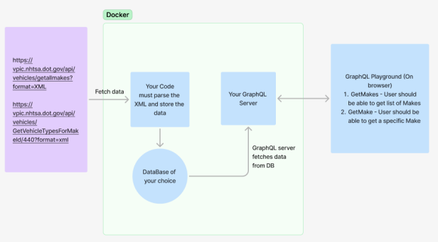
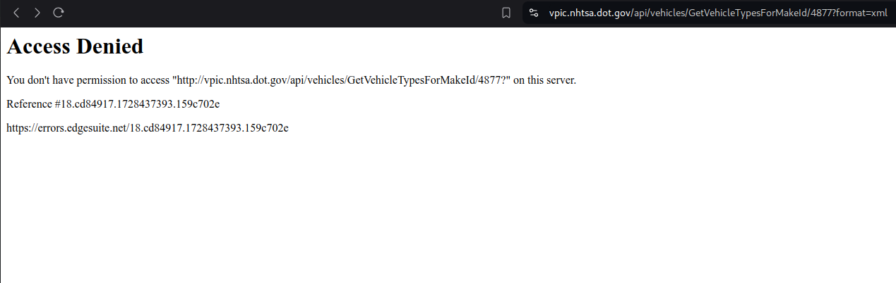

# Code Challenge

## Technologies Used

<p align='center'>
  
 
 
 
 
 
 
 
</p>

## Description



This API was developed as part of a challenge, and it must contemplate the data flow in the diagram below. After starting for the first time, and with the database empty, the Service searches for the XML with the Makes information in the data API address, about the vehicle types it was mocked, and for more details you can see in [Important](#important). Thinking about the performance and excessive use of the database, each call is cached for 5 minutes, and for this I used Redis.

## Project setup

```bash
docker compose up
```

After running this command, and waiting for the system to search for the XML list with the Makes for the first time, you will be able to access the GraphQL playground at the address below:

```bash
http://localhost:3000/graphql
```

Example Query:

```graphql
{
   GetMake(makeId: 7439){
    makeId,
    makeName,
    vehicleTypes{
      typeId
      typeName
    }
  }
  GetMakes{
    makeId,
    makeName,
    vehicleTypes{
      typeId
      typeName
    }
  }
}

```

## Run tests

```bash
# unit tests
$ npm run test
```

## Important

Due to the rate limit, as we can see in the print below, I decided to generate mocked data for the vehicle types, however in the file [MakeService](/src/application/services/make.service.ts)., it is still possible to see the implementation searching for the API, for reasons of leaving a record that it was developed.

